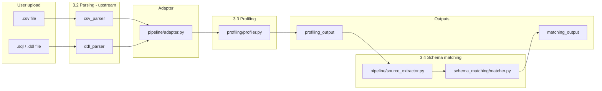

# Profiling & Schema Matching (Stages 3.3 and 3.4)

This document describes the **Profiling Layer** and **Schema Matching Layer** implemented on branch `feature/profiling-schema-matching` in the DM-Agent project. Together, these stages sit between **Parsing** (3.2, upstream) and **AI Processing** (3.5, separate branch).

---

## Table of contents

1. [Role in the DM-Agent pipeline](#role-in-the-dm-agent-pipeline)
2. [What was built](#what-was-built)
3. [Architecture](#architecture)
4. [Inputs](#inputs)
5. [Outputs](#outputs)
6. [API endpoints](#api-endpoints)
7. [Module reference](#module-reference)
8. [Stage 3.3 — Profiling in detail](#stage-33--profiling-in-detail)
9. [Stage 3.4 — Schema matching in detail](#stage-34--schema-matching-in-detail)
10. [End-to-end example](#end-to-end-example)
11. [Running locally](#running-locally)
12. [Testing](#testing)
13. [Downstream consumers](#downstream-consumers)
14. [Design safeguards (post-review)](#design-safeguards-post-review)

---

## Role in the DM-Agent pipeline

The DM-Agent transforms unstructured or semi-structured inputs (CSV files, SQL DDL scripts) into structured database designs. The full product plan follows a modular pipeline:

```
User Input → Parsing → Profiling → Schema Matching → AI Processing → EDW Generation → …
```

| Stage | Name | Branch / owner |
|-------|------|----------------|
| 3.2 | Parsing | `feature/ingestion-parsing` |
| **3.3** | **Profiling** | **`feature/profiling-schema-matching`** (this work) |
| **3.4** | **Schema Matching** | **`feature/profiling-schema-matching`** (this work) |
| 3.5 | AI Processing (LangGraph + Groq) | Separate branch |

**Profiling** analyzes each table’s columns (types, nulls, uniqueness, samples) so the system understands the data before modeling.

**Schema matching** compares **multiple** profiled sources (e.g. a CSV export and a DDL script) to find the same logical entities under different names and to suggest unified names for the AI layer.

---

## What was built

### Stage 3.3 — Profiling layer

- **`profiling/`** — Core profiler: statistical analysis for CSV data, schema-only analysis for DDL.
- **`schema_inference/`** — Maps pandas/SQL type strings to a small semantic vocabulary (`integer`, `text`, `datetime`, etc.).
- **`pipeline/runner.py`** — Orchestrates `PARSE → ADAPT → PROFILE → PERSIST` for a single file.
- **`pipeline/adapter.py`** — Converts parser output into the profiler’s input contract.
- **`pipeline/persistence.py`** — Saves profile JSON under `output/` for traceability.
- **`POST /analyze`** — HTTP entry point for single-file parse + profile.

Profiling logic was merged from `origin/profiling` and integrated with the ingestion/parsing modules.

### Stage 3.4 — Schema matching layer

- **`schema_matching/`** — Fuzzy matching of tables and columns across sources; merge suggestions.
- **`pipeline/source_extractor.py`** — Turns pipeline JSON into normalized `SchemaSource` objects.
- **`pipeline/match_runner.py`** — Runs analyze on each uploaded file, then schema matching.
- **`POST /match`** — HTTP entry point for multi-file parse + profile + match.

### Supporting files

- **`requirements.txt`** — Python dependencies (`fastapi`, `pandas`, `pydantic`, `sqlparse`, `pytest`, etc.).
- **`ingestion_parsing/main.py`** — FastAPI app wiring `/upload`, `/analyze`, and `/match`.
- **`pipeline/responses.py`** — Shared error envelope for all endpoints.
- **`tests/`** — Unit tests for normalization and schema matching (`pytest.ini` sets `pythonpath = .`).

---

## Architecture



**Single file (`/analyze`):**  
`Upload → Parse → Adapt → Profile → (optional) Persist`

**Multiple files (`/match`):**  
For each file: `Parse → Adapt → Profile` → Extract all `SchemaSource`s → `match_schemas()` → `matching_output`

---

## Inputs

### 1. User-facing file inputs

| Format | Extension | Content |
|--------|-----------|---------|
| CSV | `.csv` | Tabular data with a header row |
| DDL | `.sql`, `.ddl` | One or more `CREATE TABLE` statements |

**Constraints (API):**

- Maximum file size: **10 MB**
- `/match` requires **at least two files**
- Filenames must have a valid extension

### 2. Parser output (input to profiling)

Profiling does **not** read raw files directly in the pipeline; it consumes the **parse stage** output.

#### CSV parse output (`parse_csv`)

```json
{
  "source_type": "csv",
  "row_count": 1000,
  "column_count": 5,
  "columns": [
    {
      "name": "cust_id",
      "raw_dtype": "int64",
      "sample_values": [1, 2, 3]
    }
  ],
  "sample_rows": [
    { "cust_id": 1, "customer_name": "Alice", "email_addr": "alice@example.com" }
  ]
}
```

**Internal field (not in API `parse_output`):** `rows` — all data rows with `NaN` → `null`, used only for profiling. The pipeline strips `rows` from `parse_output` in `/analyze` and `/upload` responses to keep payloads small.

#### DDL parse output (`parse_ddl`)

```json
{
  "source_type": "ddl",
  "table_count": 2,
  "tables": [
    {
      "table_name": "customer",
      "column_count": 3,
      "columns": [
        {
          "name": "customer_id",
          "type": "INT",
          "raw_definition": "customer_id INT PRIMARY KEY"
        }
      ]
    }
  ]
}
```

### 3. Profiler input (after adapter)

The adapter normalizes parser keys into one shape:

```json
{
  "table_name": "customers",
  "columns": [
    {
      "name": "cust_id",
      "raw_dtype": "int64",
      "sample_values": [1, 2, 3]
    }
  ],
  "rows": [
    { "cust_id": 1, "customer_name": "Alice" }
  ]
}
```

| Field | CSV | DDL |
|-------|-----|-----|
| `table_name` | From filename (extension stripped) or override | From `CREATE TABLE` name |
| `columns` | From parser `columns` | From parser `columns` |
| `rows` | From parser `rows` ( **all** CSV rows; falls back to `sample_rows` if absent) | Always `[]` → **schema-only** profiling |

**Note:** CSV profiling runs on the **full file** (up to the 10 MB upload cap). `sample_rows` (5 rows) is only for human/API preview in `parse_output`.

### 4. Schema matcher input (`SchemaSource`)

After profiling, `pipeline/source_extractor.py` builds one `SchemaSource` per logical table:

```json
{
  "source_id": "0:customers.csv::customers",
  "filename": "customers.csv",
  "table_name": "customers",
  "schema_only": false,
  "columns": [
    {
      "name": "cust_id",
      "inferred_data_type": "integer",
      "raw_type": "int64",
      "possible_primary_key": true,
      "sample_values": [1, 2]
    }
  ]
}
```

- **`source_id`**: `{file_index}:{filename}::{table_name}` — unique across all uploads (index avoids collisions when the same filename is uploaded twice).
- **`schema_only`**: `true` when no row data was available (DDL path).
- Column fields are taken from **`column_profiles`** in the profiling output.

Schema matching requires **at least two** `SchemaSource` objects (from two files, or two tables across files).

---

## Outputs

### 1. `/analyze` — single-file pipeline response

```json
{
  "pipeline": "csv",
  "filename": "customers.csv",
  "status": "success",
  "stages_completed": ["parse", "adapt", "profile", "persist"],
  "error": null,
  "saved_profile_path": "output/profile_customers.json",
  "parse_output": { },
  "profiling_output": { }
}
```

| Field | Description |
|-------|-------------|
| `status` | `success`, `partial` (DDL: some tables failed), or `error` |
| `stages_completed` | Which stages finished |
| `error` | `null` or `{ "stage": "parse|adapt|profile", "message": "..." }` |
| `parse_output` | Raw parser dict |
| `profiling_output` | See below |

#### CSV `profiling_output` shape

```json
{
  "table_name": "customers",
  "column_profiles": [
    {
      "column_name": "cust_id",
      "raw_type": "int64",
      "inferred_data_type": "integer",
      "total_count": 2,
      "null_count": 0,
      "null_percentage": 0.0,
      "unique_count": 2,
      "unique_percentage": 100.0,
      "possible_primary_key": true,
      "min": 1,
      "max": 2,
      "avg": 1.5,
      "sample_values": [1, 2],
      "is_empty": false,
      "uniqueness_detail": { },
      "numeric_stats": { },
      "categorical_stats": null,
      "date_stats": null,
      "mixed_type_detail": { }
    }
  ],
  "table_summary": {
    "table_name": "customers",
    "row_count": 2,
    "column_count": 3,
    "total_null_cells": 0,
    "overall_completeness_pct": 100.0,
    "pk_candidates": ["cust_id"],
    "high_null_columns": [],
    "constant_columns": [],
    "empty_columns": [],
    "mixed_type_columns": [],
    "numeric_columns": ["cust_id"],
    "text_columns": ["customer_name", "email_addr"],
    "date_columns": [],
    "boolean_columns": [],
    "schema_only": false
  }
}
```

#### DDL `profiling_output` shape

A **list** of per-table results (one entry per successfully profiled `CREATE TABLE`):

```json
[
  {
    "table_name": "customer",
    "status": "success",
    "error": null,
    "saved_profile_path": "output/profile_customer.json",
    "column_profiles": [ ],
    "table_summary": {
      "schema_only": true,
      "row_count": 0,
      "pk_candidates": []
    }
  }
]
```

For DDL, statistics that need row data (null %, uniqueness, numeric min/max from data) are limited; **inferred types** come from SQL keywords via `schema_inference/type_mapper.py`.

### 2. `/match` — multi-file pipeline response

```json
{
  "status": "success",
  "stages_completed": ["analyze", "extract", "match"],
  "error": null,
  "analyze_results": [
    { "pipeline": "csv", "filename": "customers.csv", "profiling_output": { } },
    { "pipeline": "ddl", "filename": "customer.sql", "profiling_output": [ ] }
  ],
  "sources_extracted": [
    { "source_id": "0:customers.csv::customers", "table_name": "customers", "columns": [ ] },
    { "source_id": "1:customer.sql::customer", "table_name": "customer", "columns": [ ] }
  ],
  "matching_output": { },
  "elapsed_ms": 29.8
}
```

#### `matching_output` shape (`SchemaMatchingResult`)

```json
{
  "source_count": 2,
  "table_entity_matches": [
    {
      "canonical_table_name": "customers",
      "confidence": 0.92,
      "source_ids": ["0:customers.csv::customers", "1:customer.sql::customer"],
      "table_names": ["customers", "customer"],
      "filenames": ["customer.sql", "customers.csv"],
      "column_matches": [
        {
          "canonical_name": "customer_id",
          "confidence": 0.85,
          "match_reason": "name_and_type",
          "mappings": [
            {
              "source_id": "0:customers.csv::customers",
              "table_name": "customers",
              "column_name": "cust_id",
              "inferred_data_type": "integer"
            },
            {
              "source_id": "1:customer.sql::customer",
              "table_name": "customer",
              "column_name": "customer_id",
              "inferred_data_type": "integer"
            }
          ]
        }
      ]
    }
  ],
  "unmatched_tables": [],
  "unmatched_columns": [],
  "merge_suggestions": [
    {
      "entity_type": "table",
      "canonical_name": "customers",
      "merged_from": [
        { "source_id": "customers.csv::customers", "filename": "customers.csv", "original_name": "customers" },
        { "source_id": "customer.sql::customer", "filename": "customer.sql", "original_name": "customer" }
      ],
      "confidence": 0.92,
      "notes": "Tables from different inputs likely describe the same entity"
    },
    {
      "entity_type": "column",
      "canonical_name": "customer_id",
      "merged_from": [
        { "source_id": "customers.csv::customers", "table_name": "customers", "original_name": "cust_id" },
        { "source_id": "customer.sql::customer", "table_name": "customer", "original_name": "customer_id" }
      ],
      "confidence": 0.85,
      "notes": "Resolved naming within entity 'customers'"
    }
  ],
  "summary": {
    "tables_matched": 1,
    "tables_unmatched": 0,
    "columns_matched": 3,
    "columns_unmatched": 0,
    "merge_suggestions_count": 4
  }
}
```

| Output section | Meaning |
|----------------|---------|
| `table_entity_matches` | Groups of tables believed to be the same entity across files |
| `column_matches` | Within each entity, columns aligned under a **canonical** name |
| `unmatched_tables` | Tables with no cross-source table match |
| `unmatched_columns` | Columns with no cross-source column match |
| `merge_suggestions` | Human- and AI-readable hints for unified naming |

### 3. Persisted artifacts

Successful profiles are written to:

```
output/profile_{table_name}.json
```

This directory is gitignored. It supports traceability and debugging; it is not required for `/match` to run.

---

## API endpoints

| Method | Path | Stages run | Files |
|--------|------|------------|-------|
| `GET` | `/health` | — | — |
| `POST` | `/upload` | Parse only (3.2) | 1 |
| `POST` | `/analyze` | Parse + Profile (3.2 + 3.3) | 1 |
| `POST` | `/match` | Parse + Profile + Match (3.2 + 3.3 + 3.4) | **≥ 2** |

### Error response format (all endpoints)

Validation and pipeline failures use a **consistent envelope** from `pipeline/responses.py`:

```json
{
  "status": "error",
  "stages_completed": ["analyze"],
  "error": {
    "stage": "input",
    "message": "At least two files are required for schema matching"
  }
}
```

Successful `/analyze` responses keep the pipeline shape (`status: "success"`, `error: null`, …). Successful `/upload` returns the parse dict directly (no `rows` field). Parse failures on `/upload` use the error envelope above.

### Example: analyze one CSV

```bash
curl -X POST "http://localhost:8000/analyze" \
  -F "file=@customers.csv"
```

### Example: match CSV + DDL

```bash
curl -X POST "http://localhost:8000/match" \
  -F "files=@customers.csv" \
  -F "files=@customer.sql"
```

Use the same form field name (`files`) for each file when calling `/match`.

---

## Module reference

```
DM-agent/
├── ingestion_parsing/
│   ├── main.py              # FastAPI app
│   ├── csv_parser.py        # 3.2 — CSV parsing
│   └── ddl_parser.py        # 3.2 — DDL parsing
├── pipeline/
│   ├── adapter.py           # Parser output → profiler input
│   ├── runner.py            # Single-file: parse → profile → persist
│   ├── match_runner.py      # Multi-file: analyze × N → match
│   ├── source_extractor.py  # Pipeline output → SchemaSource list
│   ├── persistence.py       # Save profiles to output/
│   ├── responses.py         # Shared api_error() envelope
│   └── logger.py            # Structured logging
├── profiling/
│   ├── profiler.py          # profile_table() — core 3.3 logic
│   ├── models.py            # Pydantic input/output models
│   └── utils.py             # Stats, type detection, uniqueness
├── schema_matching/
│   ├── matcher.py           # match_schemas() — core 3.4 logic
│   ├── models.py            # SchemaSource, matches, suggestions
│   └── normalize.py         # Name normalization & similarity
├── schema_inference/
│   └── type_mapper.py       # pandas/SQL → semantic types
├── tests/
│   ├── test_normalize.py
│   └── test_schema_matching.py
├── docs/
│   └── PROFILING_AND_SCHEMA_MATCHING.md   # This file
├── pytest.ini
└── requirements.txt
```

---

## Stage 3.3 — Profiling in detail

### Responsibilities

- Infer a **semantic data type** per column (`integer`, `float`, `text`, `date`, `datetime`, `boolean`, etc.).
- Compute **null rates**, **uniqueness**, and **primary-key candidacy** (zero nulls + all values unique).
- For CSV data: **numeric** stats (min, max, mean, median, percentiles), **categorical** top values, **date** ranges, **mixed-type** detection on `object` columns.
- Produce a **table summary** listing PK candidates, high-null columns, constants, and type groupings.

### Two profiling paths

| Path | Trigger | Behavior |
|------|---------|----------|
| **Data profiling** | `rows` is non-empty (CSV) | Builds a pandas `DataFrame`, runs full statistics |
| **Schema-only** | `rows` is `[]` (DDL) | Uses SQL/pandas type strings only; `table_summary.schema_only = true` |

### Semantic type vocabulary

Used consistently in profiles and schema matching:

`integer`, `float`, `decimal`, `text`, `boolean`, `date`, `time`, `datetime`, `duration`, `categorical`, `json`, `uuid`, `binary`, `array`, `unknown`

### Primary key heuristic

A column is flagged `possible_primary_key: true` when:

- `null_count == 0`, and  
- Every non-null value is unique (`unique_count == total_count`).

This is a **hint** for downstream AI/EDW stages, not a enforced constraint.

---

## Stage 3.4 — Schema matching in detail

### Responsibilities

- Find **related tables** across uploads (e.g. `customers` vs `customer`).
- Align **columns** that represent the same attribute under different names (`cust_id` vs `customer_id`).
- Propose **canonical names** and **merge suggestions** for the AI layer and human review.

### Algorithm overview

1. **Table pairing**  
   Compare every pair of `SchemaSource` table names using normalized string similarity (`schema_matching/normalize.py`).

2. **Table clustering**  
   Union-find groups tables with similarity ≥ **0.72** into one entity.

3. **Column matching (within each entity cluster)**  
   - Only **cross-source** pairs are considered (never two columns from the same file).  
   - At most **one column per `source_id`** per match group.  
   - Score: `0.62 × name_similarity + 0.38 × type_compatibility`  
   - Accept pairs with score ≥ **0.68**.

4. **Type compatibility**  
   - Same semantic type → 1.0  
   - Unknown type → 0.55  
   - Compatible groups (e.g. `integer`/`float`/`decimal`, `text`/`categorical`) → 0.78  
   - Otherwise → 0.0  

5. **Name similarity** (`normalize.py`)  
   - Lowercase, strip `_`, `-`, spaces.  
   - **No plural stripping** (avoids corrupting names like `address`).  
   - Substring boost (0.92) only when the shorter token has length ≥ 3 **and** is at least 50% of the longer token (prevents `id` ↔ `cust_id` false positives).

6. **Canonical names**  
   Prefer **DDL** (`schema_only`) table/column names when present; otherwise the longest normalized identifier.

7. **Unmatched reporting**  
   Tables or columns that do not meet thresholds are listed with a reason string for review.

### Design choices

- **No LLM** in this stage — matching is deterministic, fast, and testable.
- **Works across CSV + DDL** — relies on profiling’s `inferred_data_type`, not raw file format.
- **Multi-table DDL** — each `CREATE TABLE` becomes its own `SchemaSource`; matching can relate any table from any file.
- **DDL pipeline errors** — when every table fails to profile, `status` is `error` and top-level `error` describes the failure (not `null`).

---

## End-to-end example

**Inputs**

`customers.csv`:

```csv
cust_id,customer_name,email_addr
1,Alice,alice@example.com
2,Bob,bob@example.com
```

`customer.sql`:

```sql
CREATE TABLE customer (
  customer_id INT PRIMARY KEY,
  name VARCHAR(100),
  email VARCHAR(255)
);
```

**Result**

- One **table entity match**: `customers` ↔ `customer` → canonical table `customers`.
- Three **column matches**:  
  `cust_id` ↔ `customer_id`,  
  `customer_name` ↔ `name`,  
  `email_addr` ↔ `email`.
- Four **merge suggestions** (one table + three columns).

This gives stage 3.5 (AI) a consolidated view of “one customer entity” instead of two unrelated schemas.

---

## Running locally

```bash
cd DM-agent
python3 -m venv .venv
source .venv/bin/activate
pip install -r requirements.txt
uvicorn ingestion_parsing.main:app --reload
```

Open `http://localhost:8000/docs` for interactive Swagger UI.

---

## Testing

```bash
pytest tests/ -v
```

| Test file | Covers |
|-----------|--------|
| `tests/test_normalize.py` | Identifier normalization, substring rules, canonical name preference |
| `tests/test_schema_matching.py` | Cross-source matching, same-source non-merge invariant, input validation |

---

## Downstream consumers

The following stages (not on this branch) should use:

| Artifact | Suggested use |
|----------|----------------|
| `profiling_output` | Column semantics, PK hints, null/quality signals for entity/relationship extraction |
| `matching_output.table_entity_matches` | Which inputs describe the same business entity |
| `matching_output.column_matches` | Column lineage and rename resolution |
| `matching_output.merge_suggestions` | Prompt context or canonical model seed names |
| `parse_output` | Original structure traceability (metadata/lineage) |

Stage **3.5 AI Processing** should treat `matching_output` as structured input alongside individual `profiling_output` blobs, rather than re-deriving alignments from raw CSV/DDL alone.

---

## Branch summary

| Branch | Contents |
|--------|----------|
| `feature/ingestion-parsing` | Parsing + `/upload` |
| `origin/profiling` | Profiling only (merged into our branch) |
| **`feature/profiling-schema-matching`** | Profiling + schema matching + `/analyze` + `/match` |
| (other) | AI / LangGraph (3.5) |

---

## Related project plan sections

| Plan section | Implementation |
|--------------|----------------|
| 3.3 Profiling — data types, nulls, uniqueness | `profiling/profiler.py`, `profiling/utils.py` |
| 3.4 Schema matching — overlaps, naming, merges | `schema_matching/matcher.py` |
| Standardized intermediate representation | `ProfilerInput`, `SchemaSource`, Pydantic models |
| Traceability | `source_id`, `parse_output` retained in pipeline responses; profiles saved under `output/` |

---

## Design safeguards (post-review)

The following fixes were applied after an internal code review:

| Issue | Fix |
|-------|-----|
| Columns from the same CSV merged incorrectly (`id` + `cust_id`) | Column matching is **cross-source only**; one column per source per group |
| Profiling used only 5 sample rows | `csv_parser` adds full `rows`; adapter prefers `rows` over `sample_rows` |
| `address` → `addres` from plural stripping | Removed naive plural rule from `normalize_identifier` |
| Short-name substring false positives | Substring boost requires min length 3 and 50% length ratio |
| Duplicate `source_id` on same filename twice | Prefix `{file_index}:` in `source_extractor` |
| Inconsistent API errors | `pipeline/responses.api_error()` used by `/upload`, `/match`, and parse failures |
| DDL all-table failure returned `error: null` | `run_ddl_pipeline` sets top-level `error` when `status == "error"` |
| `/match` proceeded when zero tables profiled | `match_runner` rejects files with no successful profiles |
| No automated tests | `tests/` + `pytest` added |
| Canonical names ignored DDL | `pick_canonical_name(..., prefer=ddl_names)` for tables and columns |
